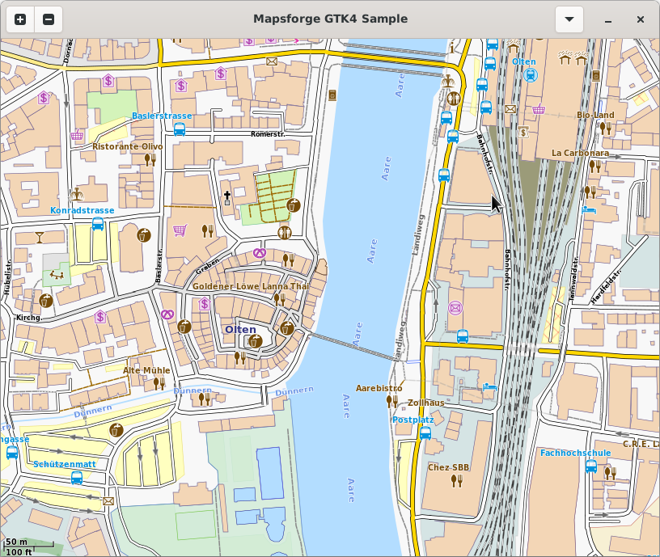

[](http://www.gnu.org/licenses/lgpl-3.0)
[](https://github.com/bailuk/mapsforge-gtk/actions/workflows/build-on-debian.yml)
[](https://jitpack.io/#bailuk/mapsforge-gtk)

# Mapsforge GTK

GTK4 based implementation of the Mapsforge MapView. It is made with [java-gtk](https://github.com/bailuk/java-gtk)


## Screenshot




## Compile and install

```bash
# build
./gradlew mapsforge-map-gtk:build

# install to local maven repository 
./gradlew mapsforge-map-gtk:publishToMavenLocal

# run sample
./gradlew mapsforge-map-samples-gtk:run
```


## Integration

Library is available via [JitPack](https://jitpack.io/#bailuk/mapsforge-gtk).  
Minimal example application: [mapsforge-samples-gtk/src/main/java/HelloMap.java](mapsforge-samples-gtk/src/main/java/HelloMap.java)

```kotlin
// build.gradle.kts
plugins {
    application
}

repositories {
    maven { url = uri("https://jitpack.io") }
}

dependencies {
    implementation("com.github.bailuk:mapsforge-gtk:0.2.0")
}

application {
    mainClass.set("HelloMap")
}
```
