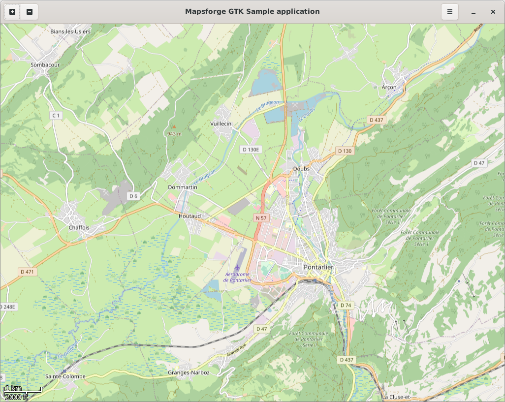

[](http://www.gnu.org/licenses/lgpl-3.0)

||


# Mapsforge Map GTK

GTK4 based implementation of the Mapsforge MapView. It is made with [java-gtk](https://github.com/bailuk/java-gtk)

## Compile and install

```bash
# build
./gradlew mapsforge-map-gtk:build

# install to local maven repository 
./gradlew mapsforge-map-gtk:publishToMavenLocal

# run sample
./gradlew mapsforge-map-samples-gtk:run
```

## Starter project

See [doc/starter](doc/starter) for a small starter sample project. 

